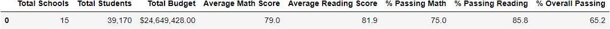
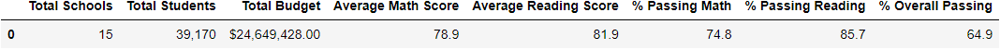
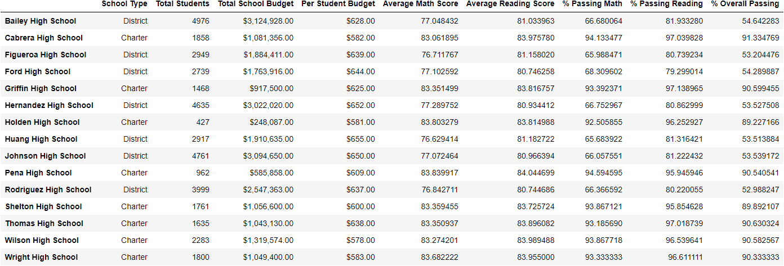
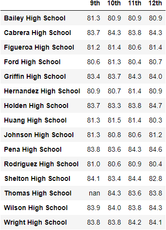
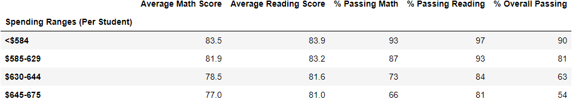
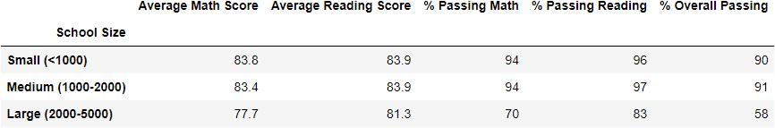
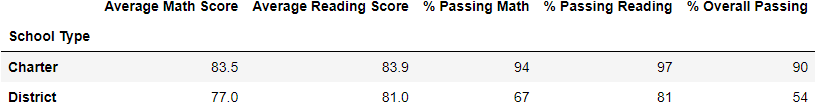

# School District Analysis

## Overview

In this analysis, I adjust the original school district analysis to account for the academic dishonesty you reported amongst ninth graders at Thomas High School. Reading and Math scores for these students have replaced with null data, and the school district analysis has been repeated to determine the overall testing performance of students at each high school in the district, as well as breakdowns by grade level, size, spending, and type. I also examine how these replacements have changed each of the metrics. 

## Results

### District Summary

Please see the original district summary here:

And the updated summary here:

The average reading score and the percent of students passing reading did not change. However, the average math score dropped by 0.1 points, the percent of students passing math dropped by 0.2, and the percent of students passing overall (both subjects) dropped by 0.3.

### School Summary

Please see the original school summary here:

And the updated school summary here:

The metrics for Thomas High School changed after correction.

* The average math score dropped from 83.418349 to 83.350937.
* The average reading score rose from 83.848930 to 83.896082.
* The percent of students passing math dropped from 93.272171 to 93.18569.
* The percent of students passing reading dropped from 97.308869 to 97.018739.
* The percent of students who passed overall (both subjects) dropped from 90.948012 to 90.630324.

### Relative Performance
After replacement, Thomas High School remains ranked second with respect to the percent of students who passed overall (both subjects). Despite the fact that this metric dropped to 90.630324 after replacement, the next highest value is for Griffin High School at 90.599455

### Math and Reading Scores by Grade
Grade replacement was limited to only 9th graders at Thomas High School, so the breakdown of math and reading scores by grade for each school is largely unaffected. Because the math and reading scores for all 9th graders at Thomas High School have been changed to null data, the average score for that group is reported as "NaN". See example Reading Scores after replacement below:

### Scores by School Spending
Please see the original scores by school spending here:

And the updated scores by school spending here:

Taking into account rounding, the scores by school spending did not change. We might have expected some change among the $630 -$644 group, since Thomas High School is in this group, but the changes in the metrics were small enough that they were absorbed by rounding.

### Scores by School Size
Please see the original scores by school size here:

And the updated scores by school size here:

Taking into account rounding, the scores by school size did not change. We might have expected some change among the medium group, since Thomas High School is a medium sized school, but the changes in metrics were small enough that they were absorbed by rounding. 

### Scores by School Type
Please see the original scores by school type here:

And the updated scores by school type here:

Taking into account rounding, the scores by school size did not change. We might have expected some change among the Charter group, since Thomas High School is a Charter school but the changes in metrics were small enough that they were absorbed by rounding. 

# Summary

Overall, the changes to the analysis after replacement of 9th grade math and reading scores at Thomas High School are relatively minor. Here are four notable examples:

* For the entire district, the percent of students passing math decreased from 75.0% to 74.8%. 
* For the entire district, the percent of students passing overall (both subjects) decreased from 65.2% to 64.9%
* At Thomas High School, the percent of students who passed overall (both subjects) dropped from 90.948012% to 90.630324%
* At Thomas High School, average reading score increased from 83.848930 to 83.896082.

